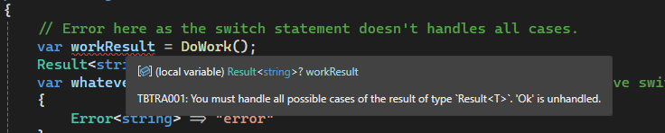

# Results!

[](https://github.com/tombatron/Tombatron.Results/actions/workflows/build.yml)

## Overview

What you have here is a basic implementation of the ["Results pattern"](https://www.milanjovanovic.tech/blog/functional-error-handling-in-dotnet-with-the-result-pattern) which by itself isn't that interesting. No, this one has a Roslyn analyzer that was inspired by the Rust language, who's `Option` type has requirements that if not met will throw compile time errors. 

Is that useful in a .NET-based application? I have no idea, but I thought it would be fun to build so here we are. 

## Installation

Installation is a snap. I recommend using the `Tombatron.Results.All` meta-package since it bundles everything together. 

The following are the related published packages. 


| Package Name                                                                               | Description                                                                                        |
|--------------------------------------------------------------------------------------------|----------------------------------------------------------------------------------------------------|
| [Tombatron.Results](https://www.nuget.org/packages/Tombatron.Results/)                     | This package contains the results pattern implementation.                                          |
| [Tombatron.Results.Analyzers](https://www.nuget.org/packages/Tombatron.Results.Analyzers/) | This package contains the Roslyn analyzer for the **Tombatron.Results** package.                   |
| [Tombatron.Results.All](https://www.nuget.org/packages/Tombatron.Results.All/)             | This is a meta-package that contains both **Tombatron.Results** and **Tombatron.Results.Analyzers. |

## Usage

### Tombatron.Results

Usage of the simplistic result pattern implementation is... simple!

Let's say that you have a method that returns a `string`, the method signature might look something like:

```csharp
public string MyExampleMethod()
```

Instead of directly returning a `string` type directly, we'll wrap our result with the generic `Result<T>` class, so now our method signature will look like:

```csharp
public Result<string> MyExampleMethod()
```

Next, we need to create an instance of `Result<T>` or in this case `Result<string>`. `Result<T>` is an abstract class, so we can't directly create an instance of it, so instead we'll leverage one of the two static factory methods that exist on the `Result<T>` type to create our result. 

The first method is `Result<T>.Ok(T Value)`. This method will return a concrete instance of the `Ok<T>` class (which inherits from the `Result<T>` class). You simply pass in the value you want to wrap as the sole parameter and you're good to go. 

**Example:**

```csharp
var okValue = Result<string>.Ok("Hi friend!");
```

Above I mentioned that `Result<T>.Ok(T value)` is a "static factory method". If you'd rather construct the `Ok<T>` class directly, that's fine too. The lone constructor parameter is the value that you're wrapping. 

**Example:**

```csharp
var okValue = new Ok<string>("Sup bruh.");
```

The next method is `Result<T>.Error(string message)`. You'll use this method to communicate issues that occurred within a method. This static factory method will return a concrete instance of `Error<T>`.

**Example:**

```csharp
var errorValue = Result<string>.Error("Oh noes!");
```

For scenarios where you need to report multiple errors at once, you can use `Result<T>.Error(string[] messages)`:

**Example:**

```csharp
var multipleErrors = Result<string>.Error(new[] { 
    "Validation failed for field 'Name'", 
    "Validation failed for field 'Email'", 
    "Validation failed for field 'Phone'" 
});
```
**(New in Version 3.0)** In the event that you're handling an `Error` result and you need to instantiate a new `Error` without losing reference to the original, you can now nest an `Error` within an `Error` instance:

**Example:**

```csharp
var childError = Result<string>.Error("Child error.");

var errorWithChild = Result<string>.Error("This would be the parent error.", childError);
```

Again, like the `Ok<T>` class, we can directly construct the `Error<T>` class instead of using the static factory method. 

**Example:**

```csharp
var errorValue = new Error<string>("What did you do?!");

// Or with multiple messages:
var multipleErrors = new Error<string>(new[] {
    "Database connection failed",
    "Retry attempts exhausted"
});
```

That's really all there is to creating a result instance, but what about handling a result instance?

Well, the first thing that I'll say is that you should try to always implement handling in your code for both possiblities of `Ok<T>` or `Error<T>`. In fact, if you install the attendant Roslyn analyzer ([Tombatron.Results.Analyzers](https://www.nuget.org/packages/Tombatron.Results.Analyzers/)) it'll raise a compiler error if you don't!

The following are some different ways that you could deal with a result value. 

First, let's take a look at using a pattern matching if-statement.

```csharp
public void ExampleMethod()
{
    var resultObject = GetResultObject(); // I'm terrible at creating examples.

    if (resultObject is Ok<SomeNonExistantThing> ok) // Names are even more difficult. 
    {
        // Do some stuff
    }

    if (resultObject is Error<SomeNonExistantThing> error) // Seriously.
    {
        // Do something completely different. 
    }
}
```

Since a `Result<T>` can only be an instance of `Ok<T>` or `Error<T>` you've covered all of the possibilities, so in this case the Roslyn analyzer wouldn't complain. 

Now let's take a look at using pattern matching with a switch statment. 

```csharp
public string ExampleMethod()
{
    var resultObject = GetResultObject(); // I'm still terrible.

    return resultObject switch 
    {
        Ok<string> => "OK",
        Error<string> err => err.
    };
}
```

Simple enough. Notice that I'm not handling the default case. You won't get a compiler warning about not handling the default case, because we know that there are only two possibilities (Ok and Error) so in this case we're using the analyzer to suppress the warning.

**BUT!** What if you don't want to go through the motions of handling each possible outcome? Well, I ripped a page out of the Rust handbook and provided the methods `Unwrap()` and `UnwrapOf(T defaultValue)`. 

The `Unwrap()` method will assume you're after the `Ok<T>` value of the result, but if you call `Unwrap()` on an value that isn't `Ok<T>` the library will panic... er... it'll throw a `ResultUnwrapException`.

Alternatively, you can call the `UnwrapOr` method which will receive an argument of the value you'd like to return in the event that the instance of `Result<T>` is an `Error<T>`. The only catch here is that the default value has to be the same type as that wrapped value of the result. 

### Tombatron.Results.Analyzer

My ulterior motive for creating this library was to give me an excuse to learn a little bit about developing a Roslyn analyzer. The canned examples and simple use cases didn't really interest me. You know what did interest me? How Rust will refuse to compile if you don't handle both branches (I know there are caveats to this, settle down) of an instance of `Option<T>`.

The following is an example of the kind of error that you can expect if you don't handle both cases of a `Result<T>` instance. 



## Building

Building this project should be no more difficult than cloning this repository and issuing the `dotnet build` command.

Something to be aware of is that the `Tombatron.Results.Analyzers.Samples` project is excluded from building with the rest of the solution. This is because that project contains demonstrations of the Roslyn analyzer causing a compiler error. When building that project seperately, you'll see a demonstration of what happens when 